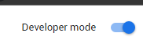
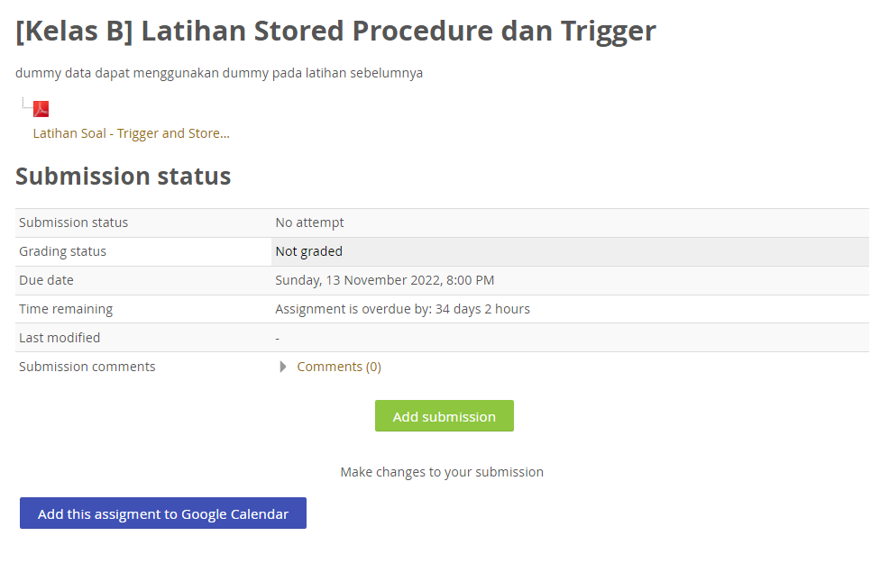
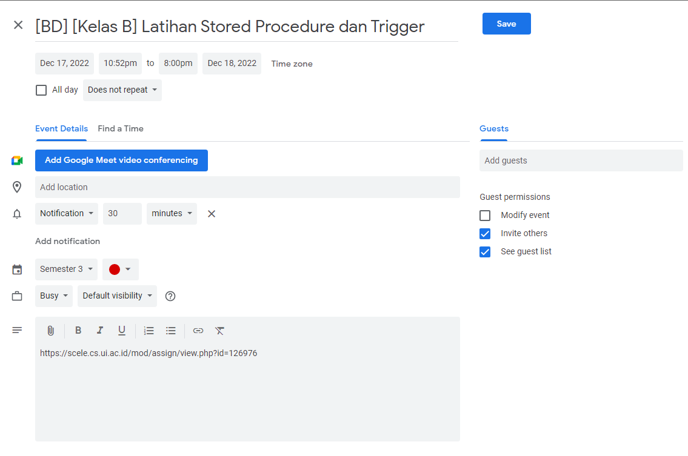

# Scele To Google Calendar
Add a scele.cs.ui.ac.id assignment to google calendar in one click!*.

<h3>Process to install in Google Chrome as extension : </h3>
<ul>
<li> git clone https://github.com/rafighalibin/sceletogooglecalendar.git </li>
<li> OR just download from Download Zip Option </li>
<li>Copy this link  <strong>chrome://extensions/</strong> and paste in Chrome</li>

<li>Enable Developer Mode and click <strong>Load unpacked extension</strong> button and select the folder</li>

 

<li>Done.</li>
</ul>

<strong>*Only works with default scele theme</strong>

<h3>#Feel free to Contribute<h3>